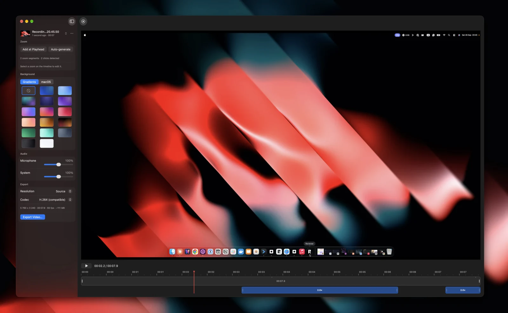
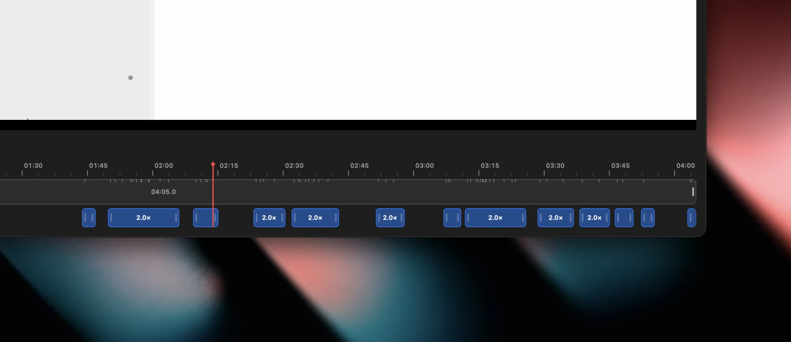
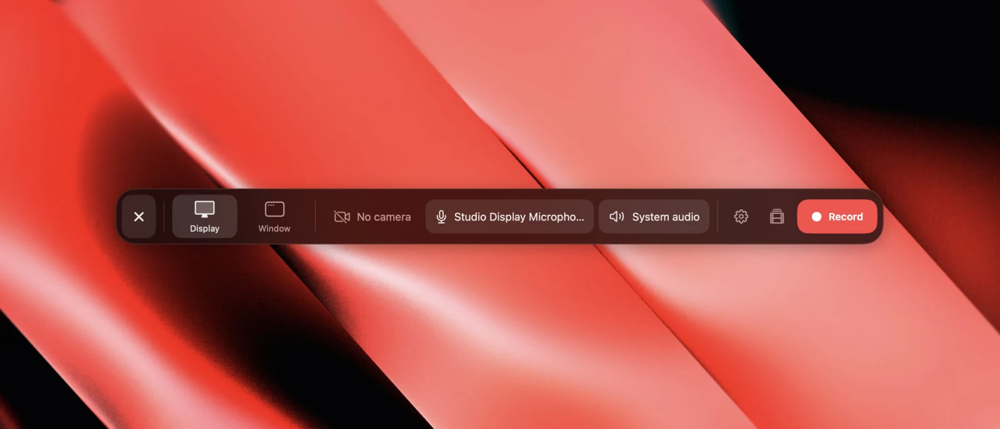
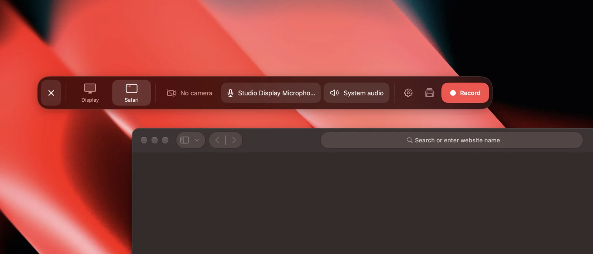
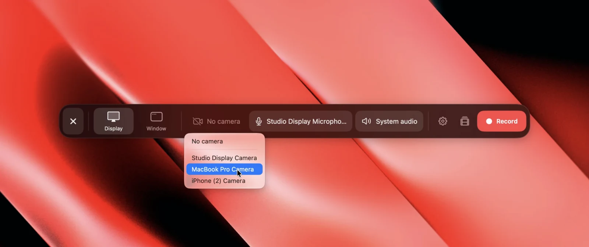
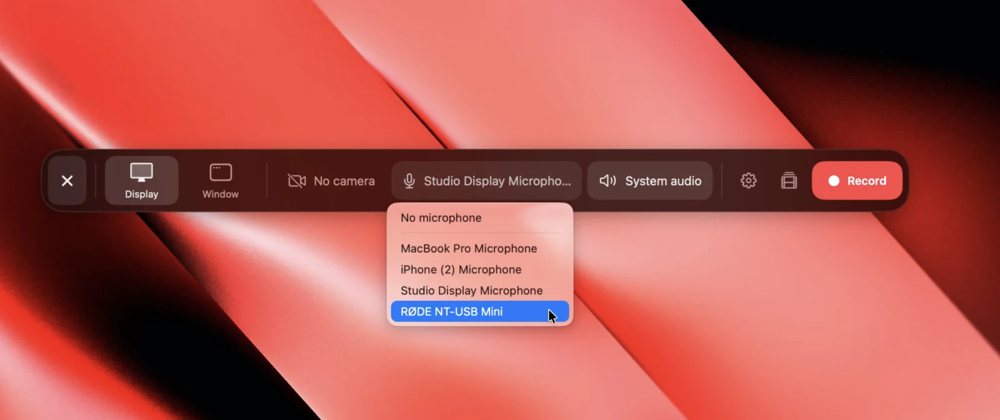
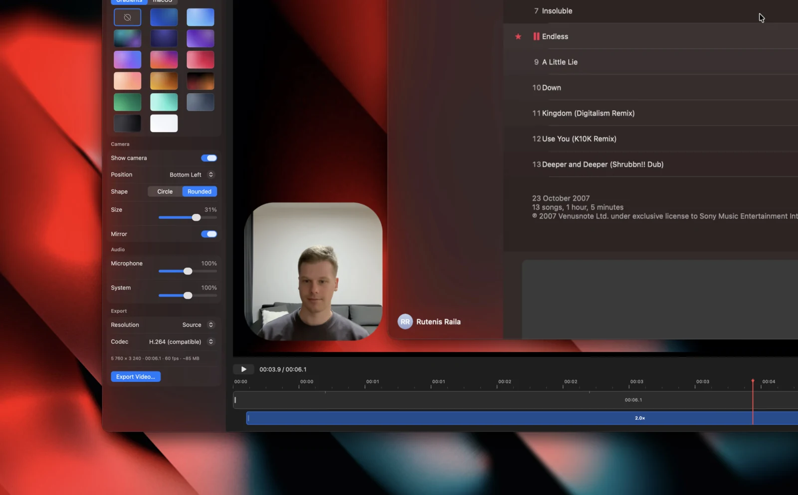
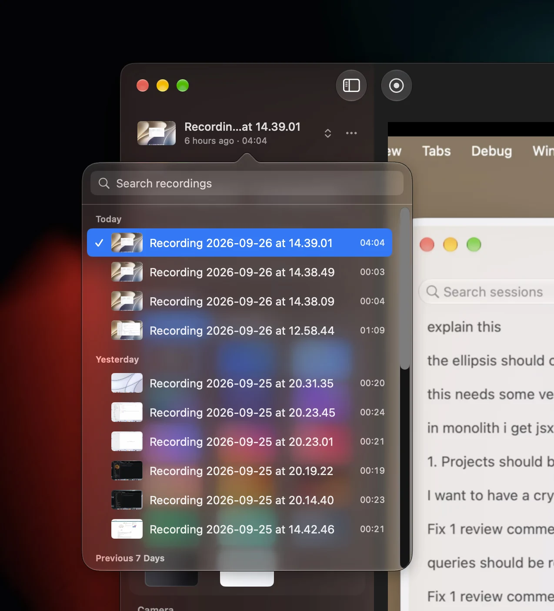

<div align="center">

<picture>
  <source media="(prefers-color-scheme: dark)" srcset="Resources/icons/screenchest-icon-dark.svg">
  
</picture>

# ScreenChest

**Your screen, your face, your voice, in one take.**

ScreenChest zooms in on your clicks, so viewers always see what you're doing.<br>
A lightweight native Mac app with a built-in editor.

[](https://github.com/Darna-Digital/screenchest/releases/latest)
[](https://github.com/Darna-Digital/screenchest/releases)
[](https://github.com/Darna-Digital/screenchest/actions/workflows/mac.yml)
[](LICENSE)
<br>
[](https://screenchest.com)
[](https://screenchest.com)
[](Package.swift)
[](Sources/ScreenChest)
[](CONTRIBUTING.md)

[**Download for macOS**](https://github.com/Darna-Digital/screenchest/releases/latest) · [Website](https://screenchest.com) · [Releases](https://github.com/Darna-Digital/screenchest/releases) · [Report a bug](https://github.com/Darna-Digital/screenchest/issues/new?template=bug_report.yml) · [Request a feature](https://github.com/Darna-Digital/screenchest/issues/new?template=feature_request.yml)

</div>

<br>



## Contents

- [Features](#features)
- [Install](#install)
- [Development](#development)
- [Contributing](#contributing)
- [License](#license)

## Features

### Automatic zooms

ScreenChest adds zooms by following your clicks and cursor, so the important
moments stand out. It gets you most of the way, and you finish the rest: drag,
resize, or add zooms right on the timeline.



### Record a display, or just one window

Camera, microphone and system audio record alongside it, lined up to the same
frame.

<table>
  <tr>
    <th>Display</th>
    <th>Window</th>
  </tr>
  <tr>
    <td width="50%">
      
    </td>
    <td width="50%">
      
    </td>
  </tr>
</table>

### Use any connected camera or microphone

Pick from every camera and microphone your Mac can see: the built-in ones, a
Studio Display, a USB mic, or your iPhone through Continuity Camera.

<table>
  <tr>
    <th>Camera</th>
    <th>Microphone</th>
  </tr>
  <tr>
    <td width="50%">
      
    </td>
    <td width="50%">
      
    </td>
  </tr>
</table>

### Put yourself in the corner

Add your camera as a bubble and pick its corner, size and shape. Mirror it so
you look the way you expect to.



### All your recordings in one place

Every take lands in one library, with thumbnails, search and the edits you made
to each. Pick one up right where you left it.



### And the rest

- **Frame it nicely** — Set your recording on a wallpaper or gradient, with
  padding, rounded corners and a shadow.
- **Audio** — Balance your microphone against system audio before you export.
- **Plain files on your Mac** — Each recording is a package in your Movies
  folder, edits included.
- **Native to the Mac** — Built with SwiftUI for macOS 26 and later.

## Install

1. Download the latest `ScreenChest-<version>-arm64.dmg` from
   [**Releases**](https://github.com/Darna-Digital/screenchest/releases/latest)
   (or from [screenchest.com](https://screenchest.com)).
2. Open the disk image and drag **ScreenChest** into **Applications**.

**Requirements:** an Apple silicon Mac on macOS 26 or later.

Every release is signed with a Developer ID and notarized by Apple. ScreenChest
keeps itself up to date: new versions are offered in-app as they ship.

On first launch, allow **Screen & System Audio Recording** in System Settings.
ScreenChest asks for **Camera** and **Microphone** only when you turn them on.

## Development

ScreenChest is a Swift package: a SwiftUI/AppKit app built on ScreenCaptureKit,
AVFoundation and Core Image. Preview and export share one renderer, so what you
see in the editor is what you get in the file.

| Path                                               | What it is                                                                   |
| -------------------------------------------------- | ---------------------------------------------------------------------------- |
| [`Sources/ScreenChest`](Sources/ScreenChest)       | The macOS app                                                                |
| [`Tests/ScreenChestTests`](Tests/ScreenChestTests) | Unit tests, and an integration test that exports through the real compositor |
| [`Resources`](Resources)                           | `Info.plist`, entitlements and the app icon                                  |
| [`scripts`](scripts)                               | Build, install, watch, signing and release scripts                           |
| [`www`](www)                                       | [screenchest.com](https://screenchest.com), on Cloudflare Workers            |

```
Sources/ScreenChest/
  App/        SwiftUI app, recorder window, floating recording panel
  Capture/    ScreenCaptureKit stream, camera/mic session, asset writer, mouse tracker
  Project/    Project model, package storage, auto-zoom, zoom track
  Rendering/  Render plan, Core Image frame renderer, AVVideoCompositing, composition builder
  Editor/     Editor model, player, timeline, inspector, exporter
```

### Prerequisites

- macOS 26 with **Xcode 26** (Swift 6.2)
- For the website: **Node.js** (current LTS) and **pnpm** (`corepack enable`)

### Run it locally

```bash
make run
```

| Command                              | Does                                                    |
| ------------------------------------ | ------------------------------------------------------- |
| `make run`                           | Build `build/ScreenChest.app` and open it               |
| `scripts/watch.sh`                   | Rebuild and relaunch the app on every save              |
| `make install`                       | Build and install into `/Applications`                  |
| `swift test`                         | Unit tests and the export integration test              |
| `scripts/create-signing-identity.sh` | A local signing identity, so macOS keeps its grants     |
| `pnpm --dir www dev`                 | The screenchest.com site                                |

macOS ties the Screen Recording grant to the app's code signature, and an
ad-hoc signed build gets a new one every time. Run
`scripts/create-signing-identity.sh` once and every build after it is signed
with the same identity, so the grant sticks.

Each recording is a package in `~/Movies/ScreenChest/<name>.screenchest`
holding `screen.mov`, `camera.mov` (if enabled), `mouse.json` and
`project.json` (your edits, autosaved).

### Releasing

Releases are built, signed, notarized and published by GitHub Actions when a
version bump lands on `main` — see [RELEASING.md](RELEASING.md).

## Contributing

Bug reports, ideas and pull requests are all welcome. Read
[CONTRIBUTING.md](CONTRIBUTING.md) to get started, and please follow the
[Code of Conduct](CODE_OF_CONDUCT.md). Security issues go through
[SECURITY.md](SECURITY.md), not public issues.

## License

ScreenChest is released under the [MIT License](LICENSE).

<div align="center">
<br>
<sub>Made by <a href="https://darnadigital.com">Darna Digital</a>.</sub>
</div>
